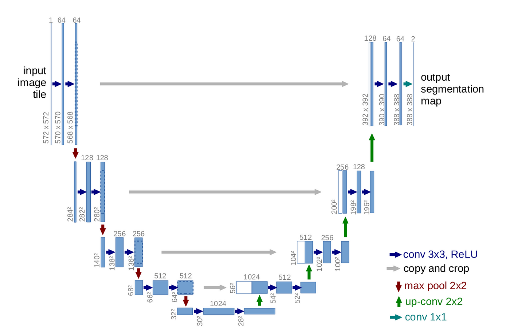
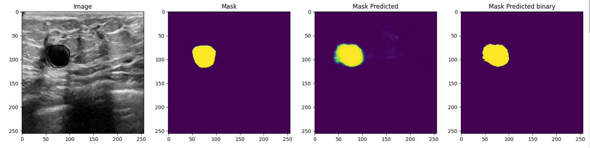
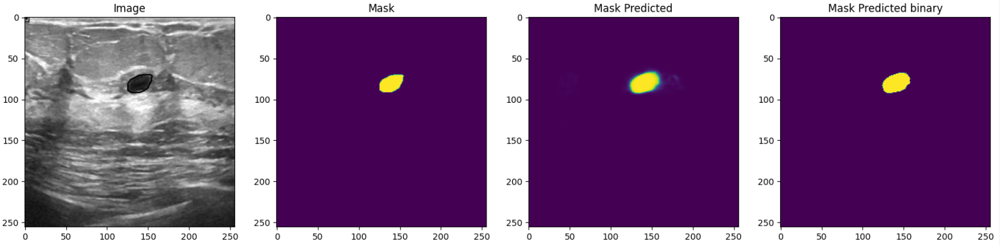
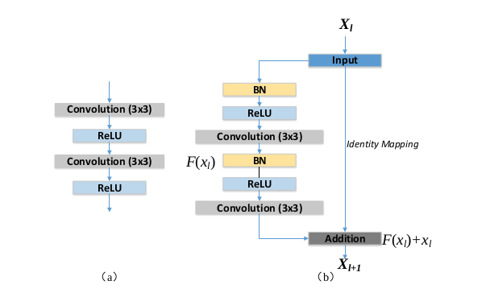

# Breast Tumor Segmentation

This is a Project to survey the performance of different CNN architectures on segmenting breast tumors. All the information about the Dataset can be found [here](https://www.kaggle.com/datasets/aryashah2k/breast-ultrasound-images-dataset). 

## 1. Architectures 

### 1.1 UNet

#### 1.1.1 Architecture

#### 1.1.2 Segmentation Results

### 1.2 Attention UNet

#### 1.2.1 Architecture

          Block Diagram of the Attention UNet Architecture

         Schematic of the Attention Gate

#### 1.2.2 Segmentation Results

### 1.3 ResUNet

#### 1.3.1 Architecture

Schematic of the Residual Block.

Residual UNET

#### 1.3.2 Segmentation Results

## 2 Loss Function

